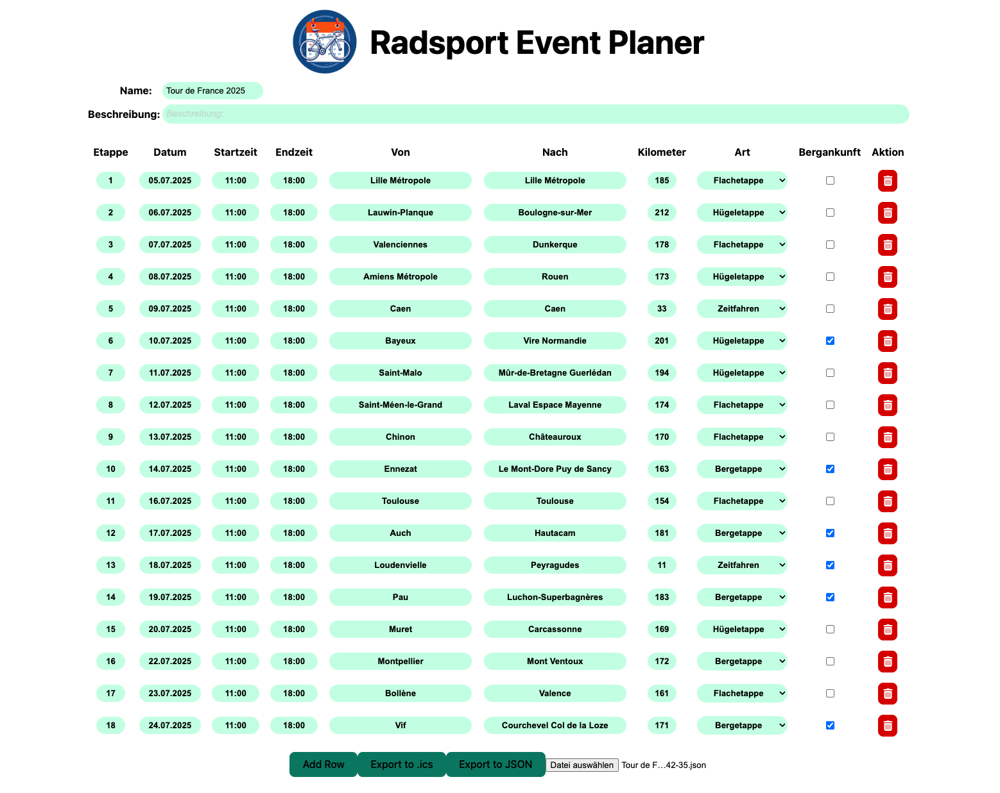
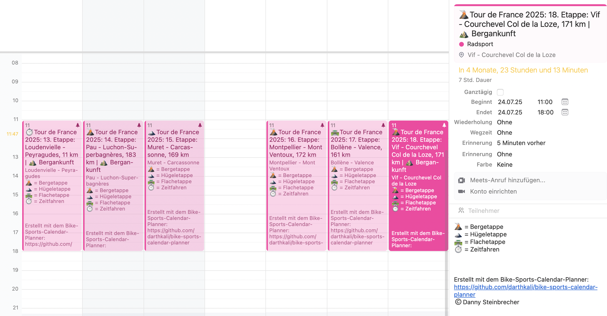

# CCC - Cycling Calendar Creator

<div style="display: flex; justify-content: center;">

</div>
 (logo was created with mistral.ai)

## Features
- create an event like the Tour de France
- add stages
- select date and time
- add the type like Flat- Hill- Mountain- and TimeTrail-stage
- is it a mountain finish
- add a description
- export / import as json to work on it later
- create the calendar-file als .ics



This is how the export could look like:


## Start / Install
Currently, there is no other option as to run it wirh vite locally.
Start die app by open your terminal, go into the main directory and use the following commandf:
```
vite
```

In the future I will also add a docker-image.


